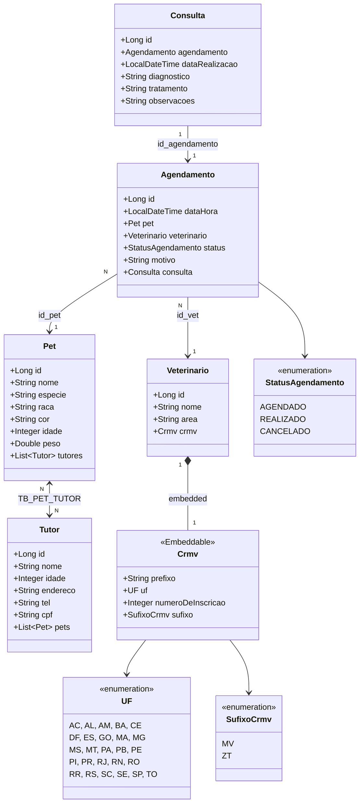
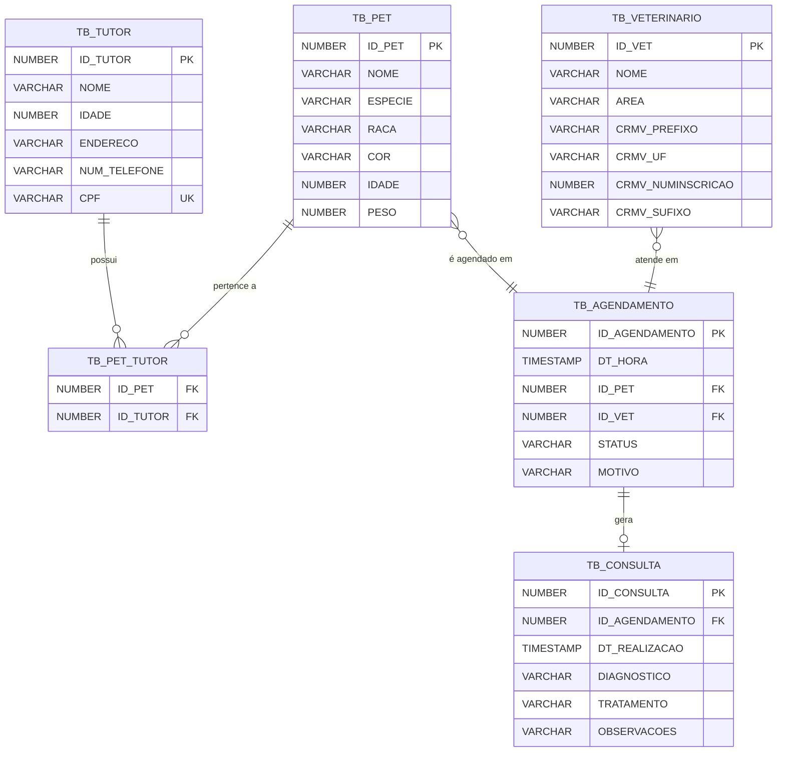

# 🐾 Clyvo — Sistema de Gestão Clínica Veterinária

API RESTful desenvolvida com Java e Spring Boot para gerenciamento de clínicas veterinárias.  
O sistema permite cadastrar tutores, pets e veterinários, realizar agendamentos de consultas e registrar o histórico clínico dos animais.

---

## 👥 Equipe

|         Nome        |   RM   |  Turma |
|---------------------|--------|--------|
| Bruno A Zanaeli     | 563736 |        |
| Christian S Freitas | 566098 |        |
| Pedro P Biasolli    | 562521 | 1TDSPO |
| Rodrigo Tiezzi      | 562975 |        |
| Maheus E Souza      | 562532 |        |
-----------------------------------------

## 🛠️ Tecnologias Utilizadas

| Tecnologia | Versão |
|------------|--------|
| Java       |   17   |
| Spring Boot | 4.0.6 |
| Spring Data JPA | 3.x |
| Oracle Database | 19c |
| Hibernate | 6.x |
| SpringDoc OpenAPI (Swagger) | 2.8.8 |
| Bean Validation | 3.x |
| Maven | 3.3.4 |

---

## 🏗️ Arquitetura

O projeto segue a arquitetura em camadas:

```
Controller → Service → Repository → Database (Oracle)
```

```
src/
├── controllers/       # Endpoints REST
├── services/          # Regras de negócio
├── repository/        # Acesso ao banco de dados (Spring Data JPA)
├── model/             # Entidades JPA
├── enums/             # Enumerações (StatusAgendamento, UF, SufixoCrmv)
└── exceptions/        # Tratamento global de erros
```

---

## 📊 Diagrama de Classes



---

## 🗄️ DER — Diagrama Entidade-Relacionamento



---

## 🚀 Como Rodar o Projeto

### Pré-requisitos

- Java 17+
- Maven 3.x
- Acesso ao banco Oracle (FIAP) - Mas pode mudar de acordo com sua preferencia no arquivo applicaion.properties

### Configuração

As credenciais do banco já estão configuradas em `src/main/resources/application.properties`:

```properties
spring.datasource.url=jdbc:oracle:thin:@oracle.fiap.com.br:1521:ORCL
spring.datasource.username=SEU_RM
spring.datasource.password=SUA_SENHA
```

### Executando

```bash
# Clone o repositório
git clone https://github.com/XXXXXX/challengeClyvo.git

# Entre na pasta do projeto
cd challengeClyvo

# Execute com Maven
./mvnw spring-boot:run
```

A API estará disponível em: `http://localhost:8080`

---

## 📖 Documentação da API

Com a aplicação rodando, acesse o Swagger UI:

```
http://localhost:8080/swagger-ui.html
```

---

## 📋 Endpoints

### 👤 Tutor `/tutor`

| Método | Endpoint | Descrição |
|--------|----------|-----------|
| GET | `/tutor` | Lista todos os tutores |
| GET | `/tutor/{id}` | Busca tutor por ID |
| GET | `/tutor/nome/{nome}` | Busca tutor por nome |
| GET | `/tutor/cpf/{cpf}` | Busca tutor por CPF |
| POST | `/tutor` | Cadastra novo tutor |
| PUT | `/tutor/{id}` | Atualiza tutor |
| DELETE | `/tutor/{id}` | Remove tutor |

### 🐾 Pet `/pet`

| Método | Endpoint | Descrição |
|--------|----------|-----------|
| GET | `/pet` | Lista todos os pets |
| GET | `/pet/{id}` | Busca pet por ID |
| GET | `/pet/nome/{nome}` | Busca pet por nome |
| GET | `/pet/especie/{especie}` | Busca pet por espécie |
| GET | `/pet/tutor/{idTutor}` | Lista pets de um tutor |
| POST | `/pet` | Cadastra novo pet |
| POST | `/pet/{idPet}/tutor/{idTutor}` | Vincula tutor ao pet |
| PUT | `/pet/{id}` | Atualiza pet |
| DELETE | `/pet/{id}` | Remove pet |
| DELETE | `/pet/{idPet}/tutor/{idTutor}` | Desvincula tutor do pet |

### 🩺 Veterinário `/veterinario`

| Método | Endpoint | Descrição |
|--------|----------|-----------|
| GET | `/veterinario` | Lista todos os veterinários |
| GET | `/veterinario/{id}` | Busca veterinário por ID |
| GET | `/veterinario/area/{area}` | Busca por área de atuação |
| GET | `/veterinario/crmv/{numero}` | Busca por número CRMV |
| GET | `/veterinario/uf/{uf}` | Busca por UF do CRMV |
| POST | `/veterinario` | Cadastra novo veterinário |
| PUT | `/veterinario/{id}` | Atualiza veterinário |
| DELETE | `/veterinario/{id}` | Remove veterinário |

### 📅 Agendamento `/agendamento`

| Método | Endpoint | Descrição |
|--------|----------|-----------|
| GET | `/agendamento` | Lista todos os agendamentos |
| GET | `/agendamento/{id}` | Busca agendamento por ID |
| GET | `/agendamento/status/{status}` | Busca por status (AGENDADO, REALIZADO, CANCELADO) |
| GET | `/agendamento/veterinario/{idVet}` | Lista agendamentos de um veterinário |
| GET | `/agendamento/pet/{idPet}` | Lista agendamentos de um pet |
| POST | `/agendamento` | Cria novo agendamento |
| PATCH | `/agendamento/{id}/cancelar` | Cancela um agendamento |

### 🏥 Consulta `/consulta`

| Método | Endpoint | Descrição |
|--------|----------|-----------|
| GET | `/consulta` | Lista todas as consultas |
| GET | `/consulta/{id}` | Busca consulta por ID |
| GET | `/consulta/pet/{idPet}` | Lista consultas de um pet |
| GET | `/consulta/veterinario/{idVet}` | Lista consultas de um veterinário |
| POST | `/consulta/agendamento/{idAgendamento}` | Realiza consulta de um agendamento |
| PATCH | `/consulta/{id}/observacoes` | Atualiza observações da consulta |

---

## 📁 Estrutura de Documentação

```
docs/
├── APIClyvoRequisicoes_postman_collection.json   # Coleção Postman com todos os endpoints
├── diagrama-classes.mermaid                       # Diagrama de Classes
└── der.mermaid                                    # Diagrama Entidade-Relacionamento
```

---

## ✅ Requisitos Atendidos

- [x] Persistência de dados com Oracle
- [x] Relacionamentos JPA (`@ManyToMany`, `@ManyToOne`, `@OneToOne`, `@Embeddable`)
- [x] Bean Validation (`@NotNull`, `@NotBlank`, `@Future`, `@Positive`, etc.)
- [x] Paginação e ordenação de resultados
- [x] Busca com parâmetros
- [x] Tratamento global de exceções
- [x] Documentação com Swagger (SpringDoc)
- [x] Spring JPA Query Methods e JPQL
- [x] Regras de negócio além do CRUD
- [x] Exportação de endpoints (Postman)
